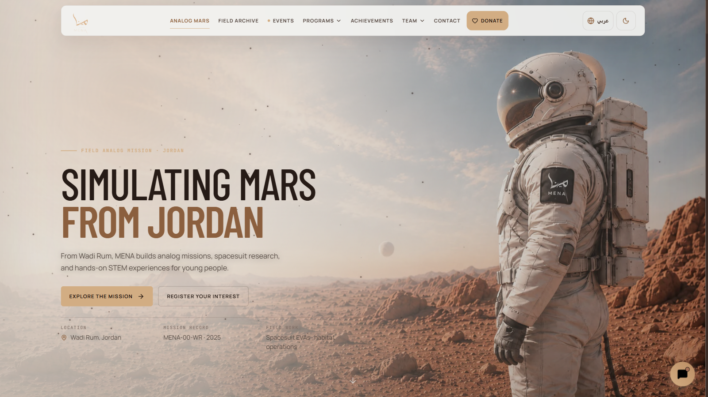
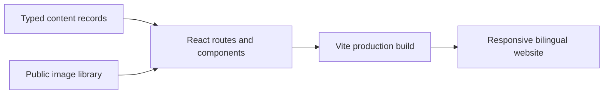

<p align="center">
  <picture>
    <source media="(prefers-color-scheme: dark)" srcset="assets/logo-dark.svg">
    <source media="(prefers-color-scheme: light)" srcset="assets/logo-light.svg">
    
  </picture>
</p>

<p align="center">The frontend for MENA Space Organization—bringing Jordan's analog Mars missions, events, research, team, and nonprofit work into one bilingual experience.</p>

<p align="center">
  
  
  
  
  
</p>

<p align="center">
  <a href="README.md">English</a> | <a href="README_AR.md">العربية</a>
</p>

Real mission photography, responsive interaction, and deliberate English/Arabic layouts replace generic space-site templates with a public record that feels distinctly MENA.

## UI Preview

<p align="center">
  
</p>

<p align="center"><sub>Light theme · desktop homepage · captured from the running application</sub></p>

The interface also includes a dark theme, mobile navigation, Arabic RTL layouts, touch-friendly galleries, a horizontally scrolling team section, event highlights, partner logos, contact routes, and donation flows.

## Who This Is For

| If you are… | Start here |
|---|---|
| Exploring MENA's work | Browse the homepage, event records, activities, research, and team pages |
| Maintaining approved content | Update typed records in `src/content/` and media in `public/images/` |
| Developing the interface | Run the project locally, then work from the routes in `src/App.tsx` |

## Highlights

- Responsive layouts designed for phones, tablets, laptops, and large displays.
- English and Arabic content with intentional RTL navigation and typography.
- Dedicated light and dark hero artwork with persistent theme selection.
- Event-first homepage storytelling backed by real mission photography.
- Team carousel, filterable galleries, lightboxes, partner showcase, and interactive starfield.
- Dedicated donation, contact, event, activity, research, and team-member routes.
- Keyboard focus states, reduced-motion behavior, and touch-sized controls.
- Optional Gemini assistant using the local `public/mena_kb.txt` knowledge base.

## Quick Start

Requirements: Node.js 20 or newer and npm.

```bash
git clone https://github.com/RKA14406/mena-website.git
cd mena-website
npm install
npm run dev
```

Open `http://localhost:3000/`. The Vite server listens on the local network as well, which makes device testing straightforward.

## Working With the Site

Validate and build the current interface:

```bash
npm run lint
npm run build
npm run preview
```

The result is a static production bundle in `dist/`; no private application backend is included.

Add or revise approved content by editing the matching typed collection:

```text
src/content/events.ts      → event cards and event pages
src/content/activities.ts  → programs and activity pages
src/content/team.ts        → team cards and member pages
src/content/partners.ts    → homepage partner logos
```

Place referenced media under `public/images/`, keep public claims tied to approved records, and register a route in `src/App.tsx` when a record needs a dedicated page.

<details>
<summary>Enable the optional Gemini assistant</summary>

Copy `.env.example` to `.env.local`, then set:

```env
VITE_GEMINI_API_KEY=your_restricted_key
```

Without the key, the rest of the site continues to work and the assistant presents fallback contact guidance.

</details>



## Security

- Never commit `.env` or `.env.local`; both are ignored.
- Every `VITE_` value is embedded in browser JavaScript. Restrict any Gemini key by API and allowed origin, or move AI requests behind a server-side proxy before production use.
- Donation checkout is handed off to PayPal; this frontend does not collect card numbers.
- Contact-form content remains in the visitor's browser until they choose WhatsApp or email.

## Contributing

Create a focused branch, keep organizational claims backed by approved material, and run both required checks before opening a pull request:

```bash
npm run lint
npm run build
```

Do not commit generated `dist/`, visual-audit captures, environment files, or deployment archives.

## License

No open-source license has been declared. All rights are reserved by MENA Space Organization unless the repository owner adds a license file.
