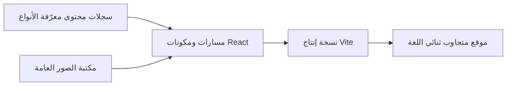

<p align="center">
  <picture>
    <source media="(prefers-color-scheme: dark)" srcset="assets/logo-dark.svg">
    <source media="(prefers-color-scheme: light)" srcset="assets/logo-light.svg">
    
  </picture>
</p>

<p align="center" dir="rtl">الواجهة الأمامية لمنظمة مينا للفضاء — تجمع مهمات محاكاة المريخ في الأردن، والفعاليات، والأبحاث، والفريق، والعمل غير الربحي في تجربة واحدة ثنائية اللغة.</p>

<p align="center">
  
  
  
  
  
</p>

<p align="center">
  <a href="README.md">English</a> | <a href="README_AR.md">العربية</a>
</p>

<p dir="rtl">تصوير حقيقي للمهمات، وتفاعل متجاوب، وتصميم مدروس باللغتين الإنجليزية والعربية؛ لتقديم سجل عام يحمل هوية مينا بدلًا من قالب فضائي عام.</p>

## معاينة الواجهة

<p align="center">
  
</p>

<p align="center" dir="rtl"><sub>الوضع الفاتح · الصفحة الرئيسية على سطح المكتب · لقطة من التطبيق أثناء التشغيل</sub></p>

<p dir="rtl">تتضمن الواجهة أيضًا الوضع الداكن، وتنقلًا مخصصًا للهواتف، وتخطيطًا عربيًا من اليمين إلى اليسار، ومعارض مناسبة للمس، وقسم فريق بتمرير أفقي، وإبرازًا للفعاليات، وشعارات الشركاء، ووسائل التواصل، ومسارات التبرع.</p>

## لمن هذا المشروع؟

| إذا كنت… | ابدأ من هنا |
|---|---|
| زائرًا يريد التعرف إلى عمل مينا | تصفح الصفحة الرئيسية، وسجلات الفعاليات، والبرامج، والأبحاث، وصفحات الفريق |
| محررًا للمحتوى المعتمد | حدّث السجلات المعرّفة الأنواع في `src/content/` والوسائط في `public/images/` |
| مطورًا يعمل على الواجهة | شغّل المشروع محليًا، ثم ابدأ من المسارات الموجودة في `src/App.tsx` |

## أبرز المزايا

- تخطيطات متجاوبة للهواتف والأجهزة اللوحية والحواسيب والشاشات الكبيرة.
- محتوى باللغتين الإنجليزية والعربية مع تنقل وطباعة مصممين لاتجاه RTL.
- صور رئيسية مستقلة للوضعين الفاتح والداكن مع حفظ اختيار المستخدم.
- سرد يركز على الفعاليات ومدعوم بصور حقيقية من المهمات.
- شريط تمرير للفريق، ومعارض قابلة للتصفية، وعارض صور، وشركاء، وخلفية نجوم تفاعلية.
- صفحات مستقلة للتبرع والتواصل والفعاليات والبرامج والأبحاث وأعضاء الفريق.
- حالات تركيز للوحة المفاتيح، ودعم تقليل الحركة، وعناصر تحكم مناسبة للمس.
- مساعد Gemini اختياري يعتمد على قاعدة المعرفة المحلية `public/mena_kb.txt`.

## البدء السريع

المتطلبات: Node.js 20 أو أحدث، و npm.

```bash
git clone https://github.com/RKA14406/mena-website.git
cd mena-website
npm install
npm run dev
```

<p dir="rtl">افتح <code>http://localhost:3000/</code>. يستمع خادم Vite أيضًا إلى الشبكة المحلية، مما يسهّل اختبار الموقع على أجهزة متعددة.</p>

## العمل على الموقع

<p dir="rtl">تحقق من الواجهة الحالية وأنشئ نسخة الإنتاج:</p>

```bash
npm run lint
npm run build
npm run preview
```

<p dir="rtl">النتيجة حزمة إنتاج ثابتة داخل <code>dist/</code>؛ ولا يتضمن المشروع خادم تطبيق خاصًا.</p>

<p dir="rtl">لإضافة محتوى معتمد أو تعديله، حرّر المجموعة المعرّفة الأنواع المناسبة:</p>

```text
src/content/events.ts      → بطاقات الفعاليات وصفحاتها
src/content/activities.ts  → البرامج وصفحات الأنشطة
src/content/team.ts        → بطاقات الفريق وصفحات الأعضاء
src/content/partners.ts    → شعارات الشركاء في الصفحة الرئيسية
```

<p dir="rtl">ضع الوسائط المشار إليها داخل <code>public/images/</code>، واربط الادعاءات المنشورة بالسجلات المعتمدة، وسجّل مسارًا في <code>src/App.tsx</code> عندما يحتاج السجل إلى صفحة مستقلة.</p>

<details dir="rtl">
<summary>تفعيل مساعد Gemini الاختياري</summary>

انسخ `.env.example` إلى `.env.local`، ثم أضف:

```env
VITE_GEMINI_API_KEY=your_restricted_key
```

من دون المفتاح، يستمر باقي الموقع في العمل ويعرض المساعد إرشادات بديلة للتواصل.

</details>



## الأمان

- لا ترفع `.env` أو `.env.local` إلى المستودع؛ فكلاهما مستبعد من Git.
- تُضمّن جميع قيم `VITE_` داخل JavaScript في المتصفح. قيّد مفتاح Gemini بحسب واجهة API والنطاقات المسموح بها، أو انقل طلبات الذكاء الاصطناعي إلى وسيط يعمل على الخادم قبل الاستخدام الفعلي.
- تُستكمل عملية التبرع عبر PayPal؛ ولا تجمع هذه الواجهة أرقام البطاقات.
- تبقى بيانات نموذج التواصل في متصفح الزائر حتى يختار الإرسال عبر WhatsApp أو البريد الإلكتروني.

## المساهمة

<p dir="rtl">أنشئ فرعًا مخصصًا للتغيير، وحافظ على ارتباط المعلومات التنظيمية بمواد معتمدة، وشغّل الفحصين المطلوبين قبل فتح طلب دمج:</p>

```bash
npm run lint
npm run build
```

<p dir="rtl">لا ترفع مجلد <code>dist/</code> الناتج، أو لقطات التدقيق المرئي، أو ملفات البيئة، أو أرشيفات النشر.</p>

## الترخيص

<p dir="rtl">لم يُعلن عن ترخيص مفتوح المصدر. جميع الحقوق محفوظة لمنظمة مينا للفضاء ما لم يضف مالك المستودع ملف ترخيص.</p>
